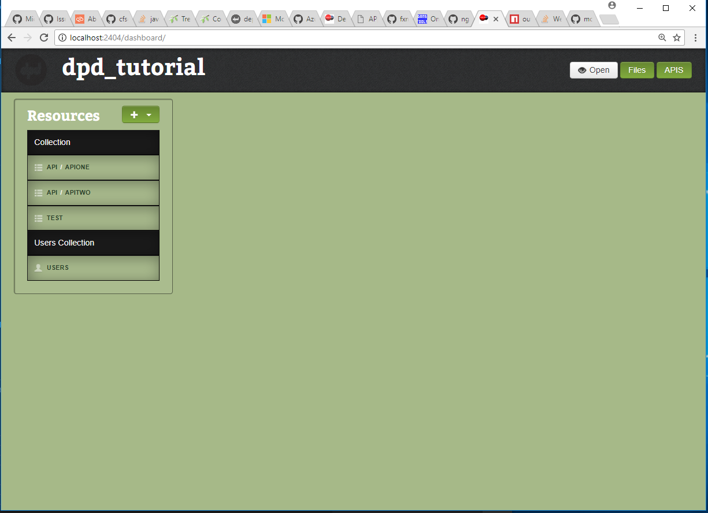
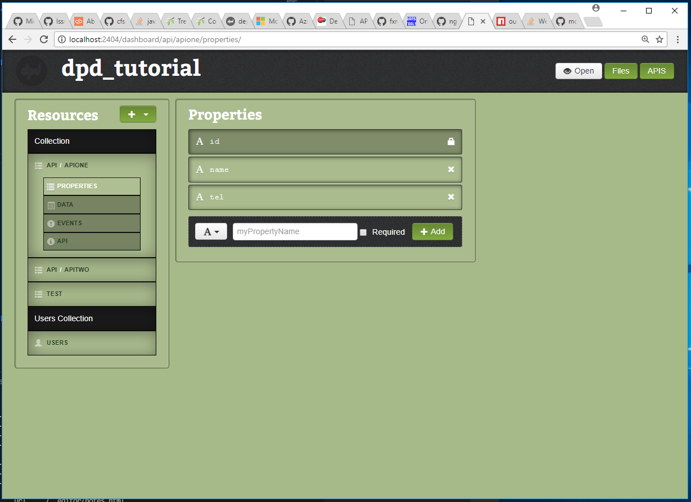
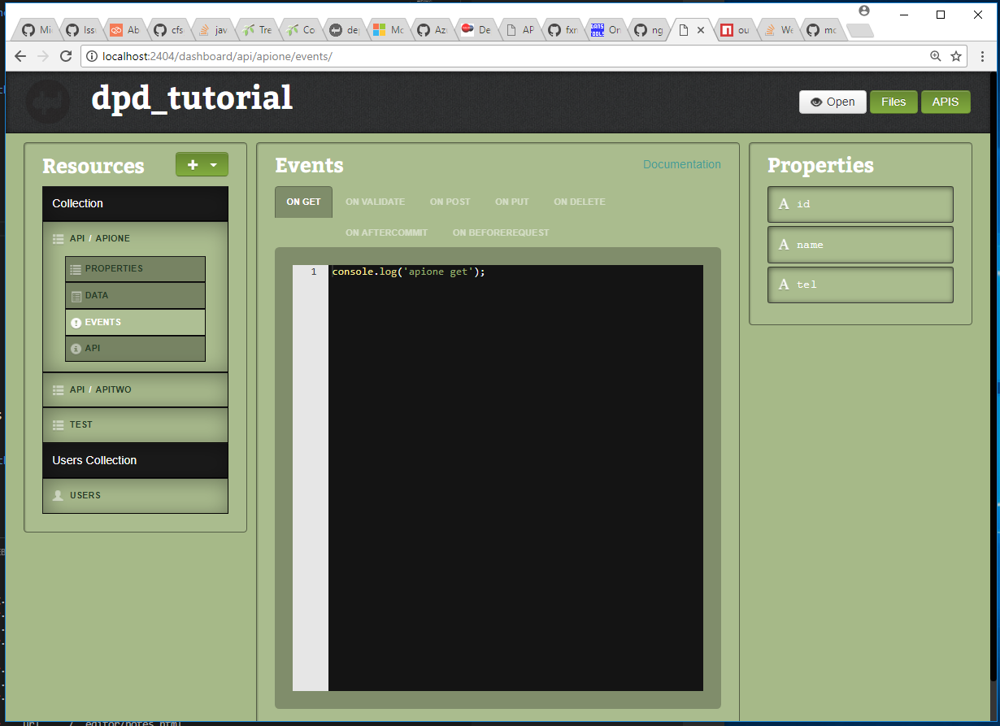
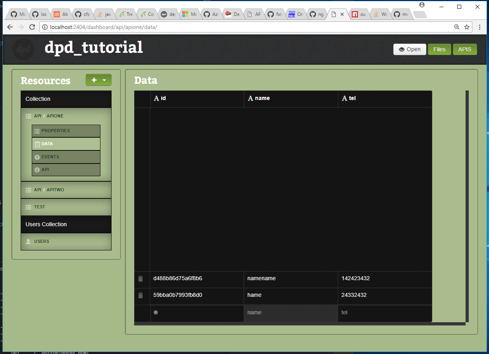
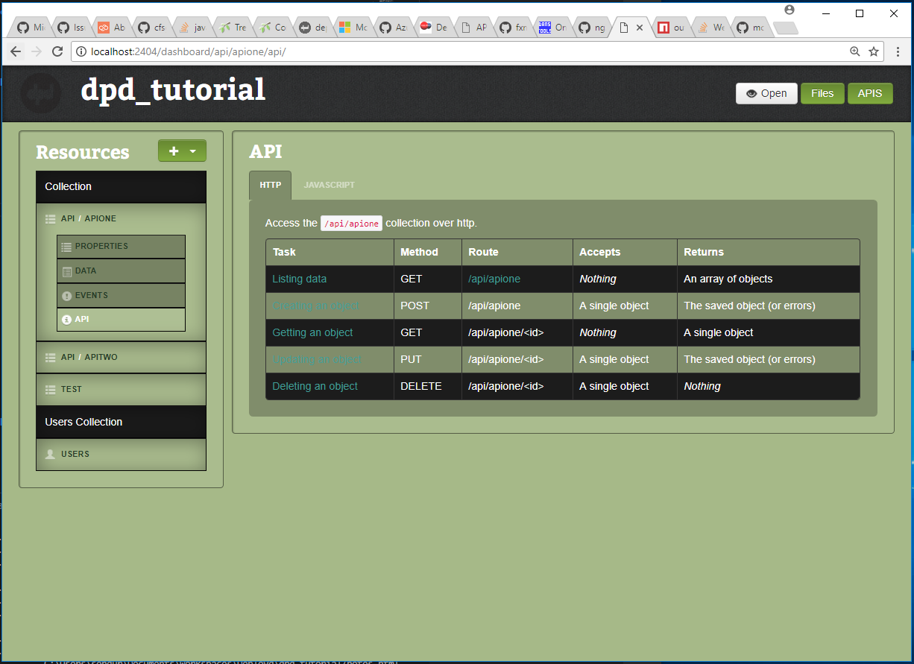
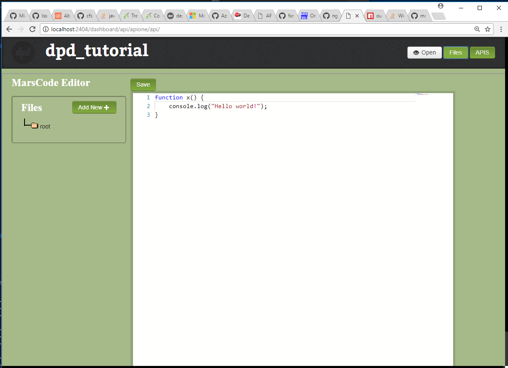
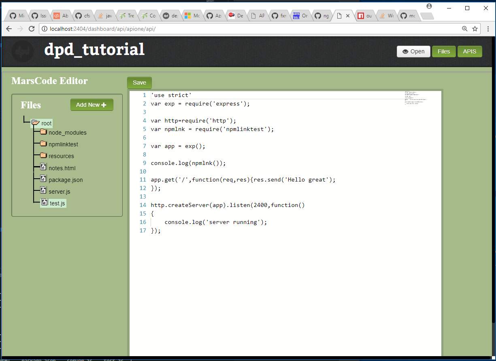

# Deployd Dashboard

[](https://gitter.im/deployd/deployd)
[](https://www.npmjs.org/package/dpd-dashboard)
[](http://travis-ci.org/deployd/deployd-dashboard)

> Add a dashboard for your [Deployd](http://deployd.com/) app

## Deployd Dashboard now becomes Deployd Studio a new Deployd IDE
New Deployd studio has these features:
1. File explorer for editing your middleware custom code (other than collection events) all in one IDE
2. New Theme

Features to be added:
1. Enable Dashboard plugins


## Getting started

To install the Deployd Dashboard in your existing Deployd project, run the following command:
```bash
npm install dpd-dashboard --save
```
Then, access the dashboard under the following address:  
[http://localhost:2403/dashboard](http://localhost:2403/dashboard)

If you do not plan to use the dashboard on production, use the following command to install it:  
```bash
npm install dpd-dashboard --save-dev
```

Screenshots:







 


## License

This project is licensed under the MIT License - see the [LICENSE](LICENSE) file for details